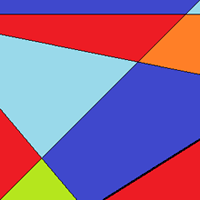
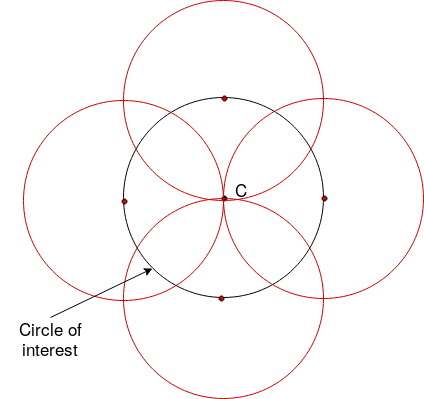

#Hough Transform

Authors : Théo Falgarone*, Tristan Maunier et Christian Té

##Introduction
Image processing is a very extensive domain composed of many features, which represents a significant amount of work for a beginner. The project entitled Tiny Image in JavaScript (TIJ) consists of grouping image processing main functions in an online toolbox in order to facilitate initiation to students.
Each students group has to develop one or more features in the form of an ImageJ plugin written in Javascript and using graphics acceleration in WebGL.
Our group work on the Hough transform used for lines and circles detection.
This project is split into three parts which can be define in the timeline as bibliography, Javascript development and the feature implementation using webGL library.
The project's first step called bibliography consists of presenting a « state of the art » and the algorithms using the Hough transform to detect lines and circles. Then a benchmark has been realised in order to compare existing ImageJ plugins and finally differents implementations of the algorithms and possible improvements are presented.

##Material & Methods
Nowadays with the automation of digital image processing, problems are encountered when identifying simple shapes such as lines or circles. Depending on the image quality, the presence of excessive noise or just following the use of an edge detector there may be missing points or pixels on the desired curves which can lead to spatial deviations between the ideal object and the noisy edge points obtained.

In this case, there is a technique called the Hough transform with which it is possible to detect and extract shapes from an image, using an algorithm able to group those potentially separate points into proper shapes.
Originally this picture processing feature was only able to identify lines in the image according to Paul Hough's method (1962)[^HOU1962], afterwards, it has been enhanced by Richard Duda and Peter Hart (1972)[^DUD1972] to detect arbitrary shapes like circles or ellipses. Some years later the Hough transform technique has been popularized by Dana H.Ballard [^BAL1981] and is better known today as Generalized Hough Transform (GHT).

In this project we focused only on the detection of lines and circles.

###Lines Detection

####Theory
Thanks to mathematics we can define a straight line with the following equation : x cos θ + y sin θ = ρ , where ρ is the distance from the origin to the closest point on the straight line, and θ is the angle between the x axis and the line connecting the origin with that closest point.

A two-dimensional image composed of pixels is represented by a plane (x, y), a pair (ρ, θ) can then be assigned to each line present in the picture. The graphical representation of the space (ρ, θ) for all existing lines in the image is called the hough space. If a point P is defined in the plane (x, y), the set of straight lines passing through this point is represented by a sinusoidal curve in the plane (ρ, θ). In other words, each point of the image corresponds to a sinusoidal curve in the Hough space. A set of two or more points that form a straight line will produce sinusoids that intersect at coordinates (ρ, θ) specific to that line. The crossing point (s) identified by coordinates (ρ, θ) in the Hough space will then be used to plot the corresponding line (s) in the initial (x,y) plane using the process reverse.

####Algorithms

In practice, the Hough transform takes place in several steps listed below:

* Convert the color image into a grayscale image
* Apply an edge detection algorithm to the grayscale image
* Apply a threshold to the edge image to clearly decide for each pixel of the image if it's an edge point or not
* Do the actual Hough transform by convert the threshold-edge image to Hough space
* Perform a threshold-based voting to find the points in Hough space that represents lines
* Convert the lines detected in Hough space back to image space to make them visible (overlayed on the source color image)

The first three steps of this list correspond to the preliminary processing which the image must be subjected to applicate the hough transform.
These operations are available in ImageJ, the use of canny edge detector for lines detection is recommended in view of the quality of the method. The user have to define the threshold's value according to the image or set of images processed.

Once outlines have been determined, the algorithm will scan the image ,pixel by pixel until it encounters a pixel defined as a point belonging to an outline. It will retrieves the coordinates (ρ, θ) of all lines passing through this point in order to trace the sinusoidal curve corresponding to this point in the Hough space. The Hough space is plotted in an accumulator, the accumulator's principle is to iterate the value  of a pixel for each curve to which it belongs. The crossing point between several curves are then highlighted. In the following example the accumulator in which the Hough space is drawn is on the left and the input image is located on the right. Note that there are four lines to be identified in the initial picture with gaps appeared after the use of the edge detector.

 

When the algorithm has finished crossing the image, the crossover points are clearly visible thanks to the accumulator.
If the process is reversed, the lines corresponding to these points are obtained from the coordinates (ρ, θ) transcribed in the plane (x, y) of the initial image. [image4]

### Circles Detection

####Theory

We can define a circle in a two-dimensional plane (x, y) by the following equation : ρ² = (x-a)² + (y-b)² ; where (a, b) is the center of the circle and ρ its radius. If a point (x, y) is fixed, then the parameters can be found according to the previous equation. The parameter space would be then three-dimensional (a, b, ρ) [image] , and all the parameters that satisfy (x, y) would lie on the surface of an inverted right-angled cone whose apex is at (x, y, 0). In the 3D space, the circle parameters can be identified by the intersection of many conic surfaces that are defined by points on the 2D circle [IMAGE2.png].

####Algorithms

To find circles with unknown radii in an image, we process the image with six steps :

* Convert the color image into a grayscale image
* Apply an edge detection algorithm to the grayscale image
* Apply a threshold to the edge image to clearly decide for each pixel of the image if it's an edge point or not
* Vote in an accumulator every point that respect the previous equation for each points detected as an edge and every possible radii
* The local maximum voted circles of the accumulator gives the circle Hough space
* The maximum voted circle of the accumulator gives the circle center and radius

Note that the first three steps can be replaced by a canny edge detector available as a plugin in ImageJ. Once we obtain the edge image, the algorithm test every pixel (x,y) who is an edge and every possible radii. Then, it votes in the accumulator matrix (a,b,ρ) the potential center circle according to the next two equations :

a = x - ρ \* cos (θ  \* π/180)

b = y - ρ \* sin (θ  \* π/180)

Finally, the algorithm selects the highest values in the accumulator which means those who have the best probability to be the searching circles. The computational complexity of this method can be high due to the fact that the circles radii are unknown.

###ImageJ plugins

By searching plugins in ImageJ allowing the detection of lines and circles using the hough transform, we found two plugins detecting circles. But sadly we didn't find any plugins about the lines detection using the hough transform. So we will explore the plugins "HoughCircle" and "DetectCircles".
The first plugin called HoughCircle requires some parameters from the user, the minimum and maximum radius, the radius search increments, the number of maximum circle and the threshold. In our case we treated our image with a canny edge finder and a threshold to make the circles detection easier. Then we run the plugin that generate the image's hough space and draw the circles according to the previous parameters. In this plugin, the hough transform is applied to every pixel detected as an edge and didn't apply any randomized selection, so the algorithm does not use the probabilistic method.
The second plugin called DetectCircles requires fewer parameters from the user, only the minimum radius, the maximum radius and a minimum score. Just like before we treated the image with a canny edge finder and a threshold to facilitate circles detection. Then we run the image in the plugin and obtain the circles with the best score, which means the ones with the highest probability to be indeed circles. Like the previous plugin, the hough transform is applied to every pixel detected as an edge and didn't apply any randomized selection, so the algorithm does not use the probabilistic method.

##Results

With the aim to write our own HoughTransform plugin, we had to search and compare already existing plugins. In order to do this, we had to make a micro-benchmarking consisting to measure the time taken by the plugin to process the picture and the memory usage.

The benchmark first use the "freeMemory" function to run the garbage collector and to print how much of the available memory in ImageJ is in use. This ensures that all the memory unused is available.
Then it declares a variable which is the number of iteration we want to run. It declares four arrays, the first one contain path to images, the second plugin's names, the third parameters for the first image, and the last one contain parameters for the second.

It is composed of three loops which run all images and process it with "canny edge detector" plugin to extract edges in the picture. Next, it process each plugin with it corresponding parameters.
For each iteration, the mean of currently memory used during the plugin is extract. A timer using "System.currentTimeMillis" is also set to get the running time of the plugin.

For each plugin used on each picture, it prints the average amount of memory used by the plugin, and the average time taken through the total of iterations perform.

Here, we have tested "Hough Circle" and "Detect Circles" on "img/three-circles.png" and "img/cells.jpeg".
All results are saved in the file "BenchmarkResults.txt"

##Discussion

Like we said before, the two plugins are using the SHT which is a method with a big computational complexity due to the fact that we analyse every pixel in an image. Several methods have been released since the first method, some of them are described as enough efficient to be applied to our project of lines and circles detection. Amongst the main algorithms that may be incorporate to our project in order to improve it we found the Randomized Hough Transform [^XU1992], the Probabilistic Hough Transform [^KIR1990] and the Progressive Probabilistic Hough Transform [^MAT].

[^HOU1962]: P.V.C. Hough, Method and means for recognizing complex patterns, U.S. Patent 3069654, 1962.
[^DUD1972]: R.O. Duda & P.E. Hart, Use of the Hough transformation to detect lines and curves in pictures, Stanford Research Institute, Menlo Park California, 1972
[^BAL1981]: D.H. Ballard, Generalizing the Hough transform to detect arbitrary shapes, Pattern recognition 13, 2, April 1981
[^MAT]: J. Matas , C. Galambos and J. Kittler, Progressive Probabilistic Hough Transform.

[^XU1992]: L. Xu  and E. Oja, Randomized Hough Transform : Basic mechanisms, algorithms and computational complexities, 1992.

[^KIR1990]: N. Kiryati, Y. Eldar and M. Bruckstein, A probabilistic Hough transform, 1990.
